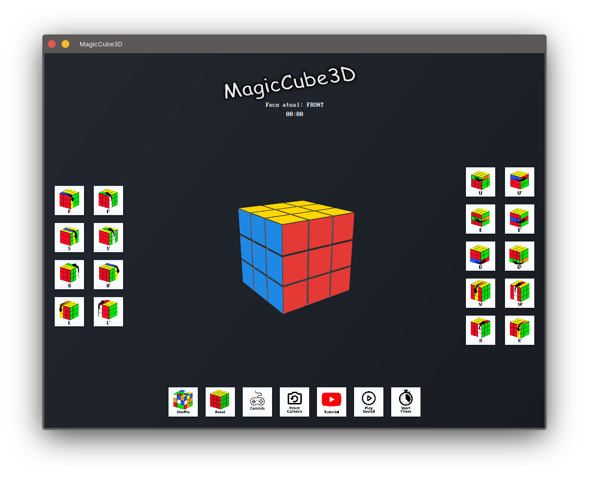

# MagicCube3D



**MagicCube3D** é uma aplicação JavaFX para simulação interativa de um Cubo Mágico 3D. Este projeto é desenvolvido para a disciplina de Programação Orientada a Objetos (CCMP0151).

## 🎯 Objetivos

* Oferecer uma ferramenta educacional e lúdica para:
  * Visualizar algoritmos de resolução do cubo.
  * Simular movimentos e estudar padrões.
  * Auxiliar no aprendizado de iniciantes com tutoriais interativos.
  * Servir como substituto digital de cubos físicos.

## ✨ Funcionalidades Essenciais

* Visualização 3D interativa do Cubo Mágico.
* Manipulação básica das faces do cubo.
* Interface gráfica intuitiva.
* Atalhos de teclado para rotação e controle da visualização.
* Música de fundo opcional.

## 🛠️ Tecnologias

* **Java 24**
* **JavaFX (com JavaFX 3D)**
* **Scene Builder**
* **Git/GitHub**

## 📁 Estrutura do Projeto

```
projeto-ccmp0151/
├── src/
│   ├── main/
│   │   ├── java/
│   │   │   └── com/univasf/magiccube3d/
│   │   │       ├── MainApp.java                   // Classe com método main, inicia a aplicação
│   │   │       ├── Application.java               // Subclasse de JavaFX Application, define o start()
│   │   │       ├── model/
│   │   │       │   ├── Cube.java                  // Representa o cubo inteiro com suas faces
│   │   │       │   ├── Face.java                  // Representa uma face do cubo (3x3 Facelets)
│   │   │       │   ├── Facelet.java               // Representa um quadrado colorido da face
│   │   │       │   ├── FaceType.java              // Enum com os lados do cubo (UP, DOWN etc.)
│   │   │       ├── controller/
│   │   │       │   └── RubikController.java       // Controlador da interface, manipula eventos e botões
│   │   │       ├── view/
│   │   │       │   ├── CubeView.java
│   │   │       └── util/
│   │   │           ├── AudioConfig.java           // Configura e armazena volume global
│   │   │           ├── ModPlay3.java              // Toca arquivos .mod (música estilo tracker)
│   │   │           ├── MusicPlayer.java           // Gerencia reprodução musical e volume
│   │   │           └── SoundPlayer.java           // Toca efeitos sonoros curtos (ex: cliques)
│   │   └── resources/
│   │       └── com/univasf/magiccube3d/
│   │           ├── view/
│   │           │   └── RubikView.fxml             // Layout da interface em FXML
│   │           ├── styles/
│   │           │   └── style.css                  // Estilo visual (cores, fontes etc.)
│   │           └── music/
│   │               └── *.mod                      // Arquivos de música para fundo do jogo
├── .gitattributes                                 // Define regras de formatação para Git
├── .gitignore                                     // Arquivos e pastas ignoradas pelo Git
├── mvnw                                           // Wrapper para usar Maven localmente
├── mvnw.cmd                                       // Versão Windows do wrapper Maven
├── pom.xml                                        // Configuração do projeto Maven (dependências etc.)
└── README.md                                      // Informações e instruções do projeto
```

## 🚀 Execução

### Como executar

1. Clone o repositório:

   ```bash
   git clone https://github.com/realsnywy/projeto-ccmp0151.git
   cd projeto-ccmp0151
   ```

2. Compile o projeto usando o Maven Wrapper:

   ```bash
   ./mvnw clean install    # Para Linux/macOS
   mvnw.cmd clean install  # Para Windows
   ```

3. Execute a aplicação:

   ```bash
   ./mvnw javafx:run       # Para Linux/macOS
   mvnw.cmd javafx:run     # Para Windows
   ```

4. Você também pode executar a classe principal `com.univasf.magiccube3d.MainApp` diretamente pela sua IDE.

## ⌨️ Atalhos de Teclado

Você pode controlar o cubo usando os seguintes atalhos de teclado (lembre-se de clicar sobre o cubo para garantir o foco):

### Rotação das faces e centros

| Tecla | Movimento         | Tecla (inversa) | Movimento inverso   |
|-------|-------------------|-----------------|---------------------|
| Q     | Up (U)            | Y               | Up' (U')            |
| W     | Eixo X (E)        | U               | Eixo X' (E')        |
| E     | Down (D)          | I               | Down' (D')          |
| A     | Left (L)          | H               | Left' (L')          |
| S     | Eixo M (M)        | J               | Eixo M' (M')        |
| D     | Right (R)         | K               | Right' (R')         |
| Z     | Front (F)         | B               | Front' (F')         |
| X     | Eixo S (S)        | N               | Eixo S' (S')        |
| C     | Back (B)          | M               | Back' (B')          |

### Outros comandos

| Tecla / Mouse               | Função                              |
|-----------------------------|-------------------------------------|
| Espaço (Space)              | Embaralhar o cubo                   |
| Backspace                   | Resetar o cubo                      |
| R                           | Resetar a câmera                    |
| P                           | Tocar/parar música de fundo         |
| Numpad 8 / 5                | Girar visualização (vertical)       |
| Numpad 4 / 6                | Girar visualização (horizontal)     |
| Numpad 7 / 9                | Girar visualização (eixo Z)         |
| Clique direito + arrastar   | Rotacionar a câmera em torno do cubo|
| Clique do meio + arrastar   | Panorâmica da câmera                |
| Scroll                      | Zoom (aproxima/afasta)              |

**Observação:** Os atalhos funcionam apenas quando o cubo está com o foco (clique sobre o cubo antes de usar o teclado).

---

> Este projeto é de caráter acadêmico e foi desenvolvido exclusivamente para fins educacionais.
